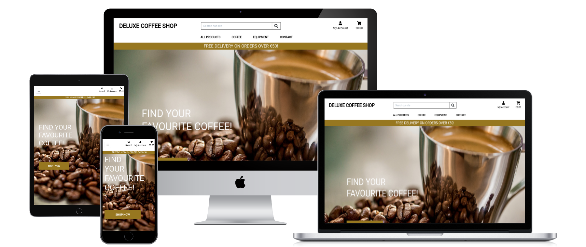

# Deluxe Coffee Shop
[View life project here](https://msp4-deluxecoffeeshop.herokuapp.com/)

Deluxe Coffee Shop is an e-commerce store selling coffees and coffee equpiments. The website was created for the people passionated in coffee and would like to find everything in one place. The online shop offers products from different brands and it's aim is to encourage people to easy and friendly e-shopping.

## User stories
### As a shopper I want to be able:
1. *View a list of products, so I can select some to purchase.
2. *View individual product details, so I can identify the price, description, product rating, product image and product sizes and also previous customers reviews.
3. *Easily view total of my purchases at any time, so I can avoid spending too much money.
4. *Sort the list of available products, so I can easily identify best rated, best priced and categorically sorted products.
5. *Sort a specyfic category of product, so I can find best-rated or best-priced products in a specific category or sort the products in that category by name.
6. *Sort multiple categories of products simultaneously, so I can find best-rated or best-priced products across broad categories such as 'coffee' or 'equipment'.
7. *Search for the product by name or description, so I can find a specific product I'd like to purchase.
8. Easily see what I have searched for and the numbers of results, so I can quickly decide whether product I want is available.
9. *Easily select the size and quantity of a product, when purchasing it, so I can ensure I don't accidentally select the wrong product or quantity.
10. *View items in my bag to be purchased, so I can identify the total cost of my purchase and all items I will recive. 
11. *Adjust the quantity of individual items in my bag, so I can easily make changes to my purchases before checkout.
12. *Easily enter my payment information, so I can check out quickly and with no hassies.
13. *Feel my personal and payment information are safe and secure, so I can confidently provide the needed information to make a purchase. 
14. *View an order confirmation after checkout, so I can verify that I haven't made any mistakes. 
15. *Recive an email confirmation after checking out, so I can keep the confirmation of what I have purchased for my records.
### As a site visitor I want to be able:
1. *Easily register for an account, so I can have a personal account and be able to view my profile.
2. *Easily log in or log out, so I can access my personal account information 
3. *Easily recover my password, in case I forgot it, so I can recover access to my account.
4. *Recive an email confirmation after registering, so I can verify that my account registration was successful.
5. *Have a personalize user profile, so I can view my personal order history and order confirmations, and save my payment information.
6. *Have a possibilities to visit Deluxe Coffee Shop social media, so I can connect with the "coffee lovers" sociaty.
7. *Have an access to articles posted on blog and possibilities to comment them, so I can read an interesting articles and share my opinions with others.
### As a shop owner I want to be able:
1. *Add a product, so I can add new items to my store.
2. *Edit/update a product, so I can change product prices, descriptions, images and other product criteria.
3. *Delete a product, so I can remove items, that are no longer for sale.  
4. *Add/Edit and Delete posts on the blog, so I can moderate the blog. 
## Design
### Colour Scheme
The main colours used are: white, black, #555, #fafafa and #977720.
### Typography
* The Roboto font is the main font used throughout the whole website with Sans Serif as the fallback font in case for any reason the font isn't being imported into the site correctly.
### Imagery
Imagery is important. The large, background hero image is used to be striking and catch the user's attention. Additionally all the products in the e-commerce shop are having images, the same like the blog posts. 
## Wireframes
* Home Page Wireframe - [View]()
* Tablet Wireframe - [View]()
* Mobile Wireframe - [View]()
## Features
### Responsivness 
The page is responsive at all breakpoints. By using a combination of media queries, Bootstrap’s responsive grid and built in flexbox capabilities means the sites layout remains consistent while the content adapts to the device it’s being viewed on.
Icons representing the social media links appear in the footer on the front page. Each icon is associated with the intended destination and clicking them will send the user there via a new window or tab.
### Navigation 
A fixed navigation bar means that links to any other section of the website and are accessible at any point for easier navigation.
The Deluxe Coffee Shop - logo has a secondary feature as a link back to the home page. All other links are where a user would expect to find them making for good UX. The search bar is always accessible in the navigation bar. 
The number of items (if any) in a customer’s bag is displayed as a counter on the cart icon, becouse of that customers can keep see at any time the number of items they’re purchasing.
### Buttons
Active buttons are used throughout the site to engage with the user and point them to relevant pages of the site or to perform certain tasks. All buttons are clear and obvious in what they do and function as expected. 
### Toasts
Toasts are used throughout to relay information back to the user. These could be anything from welcoming a user when logging in, telling them their cart has been amended or confirming their purchase.
The toasts also enhance UI by providing a customer a preview of their cart, telling them how much more they need to spend to qualify for free delivery and links them to the cart via a button.
### Home
A hero image fills the majority of the page when it first loads. A call-to-action button aimed at directing traffic towards the shop page is layered on this image.
### Products page
Results shown in the Deluxe Coffee Shop are done according to how the user has selected them to be sorted or filtered.
Filters can be applied through the products page or search button in the navigation bar.
Results can be sorted by numerous options by using the dropdown filter at the top of the products page. This helps users find what they want as quickly as possible. Products are shown as cards when numerous results are being shown. 
Individual product pages show all the information about the product: description, price, rating, size.
Items can be added and removed to a bag by registered users. 
### The checkout process
The delivery banner that’s displayed at the top of the bag page informs the user how much more they need to spend in order to get free delivery. This may nudge customers towards ordering a couple more products in order to qualify.
Quantities of items can be adjusted in the cart by using the quantity selector buttons along with the update and remove links.
All information in the cart, checkout and checkout confirmation pages is shown in intuitive way prioritising information that is most important. Totals are shown in a clear and obvious manner; these are updated as the bag has been changed.
On the checkout page there is a summary of all the items we’re about to purchase. 
The checkout form gets default information has been saved to the user’s profile. This will speed up the checkout process for returning users. The option to change this information is given when checking out a new order. The customer has the option to override existing information. 
When the checkout process is complited the order recipe is displayed, and after saved in the orders history on the user's profile page. 
### Blog and individual blog posts
All blogs posts are shown in order of the date they were posted, with the most recent first.
Each card contains a preview of each post and a call-to-action button to encourage the user to click and read the article.
Each article has its own page. The page is highly responsive to screen width as things such as blogs and articles tend to be read on tablets and phones.
Comments on the posts are visible for all to see at the bottom of every article. Only registered users can post comments; this functionality was built in to encourage interaction between users and give them a platform to voice their opinions and thoughts.
### Profile
Every user is assigned to profile page on registration. Order history will appear on this page. From here a user will be able to access any old order confirmation that was generated at the time of order by clicking the order number as it acts a link.
### Adding, editing and deleting
Only admin can add, edit and delete products or blog posts. Some of the fields are required in order to submit a form, validation messages will appear to help with input if needed.
### Features Left to implement
* I would like to ...
* I would like to ....
* I would like to ...
## Technologies Used
### Languages Used
* [HTML5](https://en.wikipedia.org/wiki/HTML5)
* [CSS3](https://en.wikipedia.org/wiki/CSS)
* [JavaScript](https://en.wikipedia.org/wiki/JavaScript)
* [Python](https://en.wikipedia.org/wiki/Python_(programming_language))
### Databases
* Postgres – Production database provided via Heroku.
### Frameworks, Libraries & Programs Used
1. [Bootstrap 4.4.1](https://getbootstrap.com/):
* Bootstrap was used to assist with the responsiveness and styling of the website.
2. [Django]:
* Python web framework with external libraries.External libraries are visible in the requirements.txt file.
3.	[JSON](https://en.wikipedia.org/wiki/JSON):
* JSON was used to create a data format.
4.	[Font Awesome](https://fontawesome.com/):
* Font Awesome was used on all pages throughout the website to add icons for aesthetic and UX purposes.
5.	[jQuery](https://jquery.com/):
* jQuery came with Bootstrap to make the elements responsive.
6.	[Git](https://www.gitpod.io/):
* Git was used for version control by utilizing the Gitpod terminal to commit to Git and Push to GitHub.
7.	[GitHub](https://github.com/):
* GitHub is used to store the projects code after being pushed from Git.
8.	AWS S3 Bucket. 
* Cloud storage for media and static files used by Heroku.
9. Stripe. 
* Online payment processing for internet businesses used to receive payments.
10. Gmail. 
* I've hooked my deployed site up to Gmail's smtp server in order to send emails.
11.	[Balsamiq](https://balsamiq.com/):
* Balsamiq was used to create the wireframes during the design process.
12.	[Techsini.com](https://techsini.com/):
* Multi Device Website Mockup Generator that helps with creating mockups of the website and allows to check its responsivness at different devices.
13. [Flask](https://en.wikipedia.org/wiki/Flask_(web_framework)):
* Flask was used to create the project app in the Python.
14. [Heroku](https://www.heroku.com/):
* Heroku was used to deploy the project.
15. Google fonts. 
* Montserrat was imported and used throughout.
## Testing
1.  Browsers:
* [Google Chrome](https://msp3-sweet-life.herokuapp.com/)
* [Safari](https://msp3-sweet-life.herokuapp.com)
2. Devices:  
* The website was viewed on a variety of devices such as Desktop, Laptop, iPhone7/8, iPhone 11 & iPhoneX.
* A large amount of testing was done to ensure that all pages were linking correctly.
3. Other: 
* Friends and family members were asked to review the site, set up their accounts and add recipes to point out any bugs and/or user experience issues and check the funcionality of the page.
4. Bugs:
### Unfixed Bugs
## Validator Testing
The W3C Markup Validator, W3C CSS Validator Services, JSHint ... were used to validate every page of the project to ensure there were no syntax errors in the project.
* HTML - [View](https://validator.w3.org/)
No errors were returned when passing through the official W3C validator
* CSS - [View](https://jigsaw.w3.org/css-validator/validator)
No errors were found when passing through the official (Jigsaw) validator 
* JavaScript - [View](https://jshint.com/)
* Python - [View](https://extendsclass.com/python-tester.html)
No errors were found when passing through the [Extendsclass.com](https://extendsclass.com/python-tester.html) validator
## Testing
Separate testing document can be found here - [testing documentation]().
## Deployment
### Heroku 
The project was deployed to Heroku using the following steps:
1. Log in to [Heroku](https://dashboard.heroku.com) account.
2. Use Heroku (Web) UI to Deploy the Application.
3. Choose the deployment method GitHub.
4. Connect to GitHub by searching for the right repository.
5. Click "Enable Automatic Deploys" to ensure that any changes made on GitHub are automatically deployed on Heroku.
6. Deply the GitHub branch "main".
7. [Deployed Website](https://msp4-deluxecoffeeshop.herokuapp.com/) 
### Cloning
## Credits
### Code 
* [Bootstrap](https://getbootstrap.com/) - liberies used through all pages to style elements: navigation bar, callout, buttons, cards and forms.
* [Code Institute]
* [Stackoverflow](https://stackoverflow.com/) - hints used to fixing some of the pylint comments.
BLOG: 
* [Djangocentral.com]https://djangocentral.com/building-a-blog-application-with-django/
* [Youtube.com]https://www.youtube.com/watch?v=hZrlh4qU4eQ
* [Skysilk.com]https://www.skysilk.com/blog/2017/how-to-make-a-blog-with-django/
### Content
* [Wikipedia](https://www.wikipedia.org/)
* [Agiboo.com](https://www.agiboo.com › 16-interesting-facts-about-co...)  
* [Ncausa.org](https://www.ncausa.org/About-Coffee/How-to-Brew-Coffee)
* [Nytimes.com](https://www.nytimes.com/2020/02/13/style/self-care/coffee-benefits.html)
* [Font Awsome](https://fontawesome.com/)
### Media
* [Unsplash](https://unsplash.com/)
## Acknowledgements
