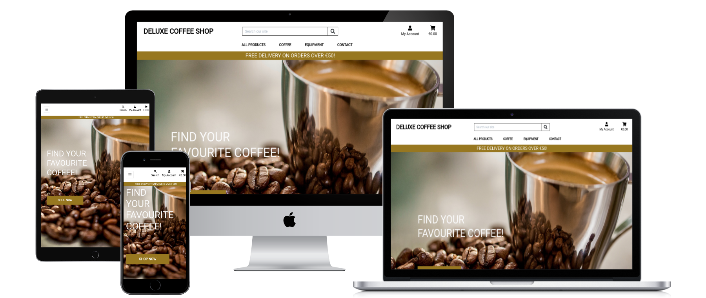

# Deluxe Coffee Shop
[View life project here](https://msp4-deluxecoffeeshop.herokuapp.com/)

Deluxe Coffee Shop is an e-commerce store selling coffees and coffee equpiments. The website was created for the people passionated in coffee and would like to find everything in one place. The online shop offers products from different brands and it's aim is to encourage people to easy and friendly e-shopping.

## User stories
### As a shopper / user I want to be able:
1. View a list of products, so I can select some to purchase.
2. View individual product details, so I can identify the price, description, product rating, product image and product sizes and also previous customers reviews.
3. Easily view total of my purchases at any time, so I can avoid spending too much money.
4. Sort the list of available products, so I can easily identify best rated, best priced and categorically sorted products.
5. Sort a specyfic category of product, so I can find best-rated or best-priced products in a specific category or sort the products in that category by name.
6. Sort multiple categories of products simultaneously, so I can find best-rated or best-priced products across broad categories such as 'coffee' or 'equipment'.
7. Search for the product by name or description, so I can find a specific product I'd like to purchase.
8. Easily see what I have searched for and the numbers of results, so I can quickly decide whether product I want is available.
9. Easily select the size and quantity of a product, when purchasing it, so I can ensure I don't accidentally select the wrong product or quantity.
10. View items in my bag to be purchased, so I can identify the total cost of my purchase and all items I will recive. 
11. Adjust the quantity of individual items in my bag, so I can easily make changes to my purchases before checkout.
12. Easily enter my payment information, so I can check out quickly and with no hassies.
13. Feel my personal and payment information are safe and secure, so I can confidently provide the needed information to make a purchase. 
14. View an order confirmation after checkout, so I can verify that I haven't made any mistakes. 
15. Recive an email confirmation after checking out, so I can keep the confirmation of what I have purchased for my records.
### As a site visitor I want to be able:
1. Easily register for an account, so I can have a personal account and be able to view my profile.
2. Easily log in or log out, so I can access my personal account information 
3. Easily recover my password, in case I forgot it, so I can recover access to my account.
4. Recive an email confirmation after registering, so I can verify that my account registration was successful.
5. Have a personalize user profile, so I can view my personal order history and order confirmations, and save my payment information.
6. Have a possibilities to visit Deluxe Coffee Shop social media, so I can connect with the "coffee lovers" sociaty.
7. Have an access to articles posted on blog and possibilities to comment them, so I can read an interesting articles and share my opinions with others.
### As a shop owner / admin I want to be able:
1. Add a product, so I can add new items to my store.
2. Edit/update a product, so I can change product prices, descriptions, images and other product criteria.
3. Delete a product, so I can remove items, that are no longer for sale.  
4. Add/Edit and Delete posts on the blog, so I can moderate the blog. 
## Design
### Colour Scheme
The main colours used are: white, black, #555, #fafafa and #977720.
### Typography
* The Roboto font is the main font used throughout the whole website with Sans Serif as the fallback font in case for any reason the font isn't being imported into the site correctly.
### Imagery
Imagery is important. The large, background hero image is used to be striking and catch the user's attention. Additionally all the products in the e-commerce shop are having images, the same like the blog posts. 
## Wireframes
* Home Page Wireframe - [View](https://github.com/KingaSzmyd/MSP4-DeluxeCoffeeShop/blob/main/media/wireframes/deluxeCoffeeShop_Main.jpg)
* Tablet Wireframe - [View](https://github.com/KingaSzmyd/MSP4-DeluxeCoffeeShop/blob/main/media/wireframes/deluxeCoffeeShop_Ipad.jpg)
* Mobile Wireframe - [View](https://github.com/KingaSzmyd/MSP4-DeluxeCoffeeShop/blob/main/media/wireframes/deluxeCoffeeShop_Iphone.jpg)
## Features
### Responsivness 
The page is responsive at all breakpoints. By using a combination of media queries, Bootstrap’s responsive grid and built in flexbox capabilities means the sites layout remains consistent while the content adapts to the device it’s being viewed on.

### Navigation 
A fixed navigation bar means that links to any other section of the website and are accessible at any point for easier navigation.
The Deluxe Coffee Shop - logo has a secondary feature as a link back to the home page. All other links are where a user would expect to find them making for good UX. The search bar is always accessible in the navigation bar. 
The number of items (if any) in a customer’s bag is displayed as a counter on the cart icon, becouse of that customers can keep see at any time the number of items they’re purchasing.
### Buttons
Active buttons are used throughout the site to engage with the user and point them to relevant pages of the site or to perform certain tasks. All buttons are clear and obvious in what they do and function as expected. 
### Toasts
Toasts are used throughout to relay information back to the user. These could be anything from welcoming a user when logging in, telling them their cart has been amended or confirming their purchase.
The toasts also enhance UI by providing a customer a preview of their cart, telling them how much more they need to spend to qualify for free delivery and links them to the cart via a button.
### Home
A hero image fills the majority of the page when it first loads. A call-to-action button aimed at directing traffic towards the shop page is layered on this image.
### Products page
Results shown in the Deluxe Coffee Shop are done according to how the user has selected them to be sorted or filtered.
Filters can be applied through the products page or search button in the navigation bar.
Results can be sorted by numerous options by using the dropdown filter at the top of the products page. This helps users find what they want as quickly as possible. Products are shown as cards when numerous results are being shown. 
Individual product pages show all the information about the product: description, price, rating, size.
Items can be added and removed to a bag by registered users. 
Registered users have also possibilities to leave review of the product, that will be seen also for the other users. The review will be displayed directly below the individual product card.
### The checkout process
The delivery banner that’s displayed at the top of the bag page informs the user how much more they need to spend in order to get free delivery. This may nudge customers towards ordering a couple more products in order to qualify.
Quantities of items can be adjusted in the cart by using the quantity selector buttons along with the update and remove links.
All information in the cart, checkout and checkout confirmation pages is shown in intuitive way prioritising information that is most important. Totals are shown in a clear and obvious manner; these are updated as the bag has been changed.
On the checkout page there is a summary of all the items we’re about to purchase. 
The checkout form gets default information has been saved to the user’s profile. This will speed up the checkout process for returning users. The option to change this information is given when checking out a new order. The customer has the option to override existing information. 
When the checkout process is complited the order recipe is displayed, and after saved in the orders history on the user's profile page. 
### Blog and individual blog posts
All blogs posts are shown in order of the date they were posted, with the most recent first.
Each card contains a preview of each post and a call-to-action button to encourage the user to click and read the article.
Each article has its own page. The page is highly responsive to screen width as things such as blogs and articles tend to be read on tablets and phones.
Comments on the posts are visible for all to see at the bottom of every article. Only registered users can post comments; this functionality was built in to encourage interaction between users and give them a platform to voice their opinions and thoughts.
### Profile
Every user is assigned to profile page on registration. Order history will appear on this page. From here a user will be able to access any old order confirmation that was generated at the time of order by clicking the order number as it acts a link.
### Adding, editing and deleting
Only admin can add, edit and delete products or blog posts. Some of the fields are required in order to submit a form, validation messages will appear to help with input if needed.
### Features Left to implement
* I would like to give the users the opportunity to rating the products.
* I would like to give users the possibility to add unavailable product to wish list and send information, when product will be available on the stock.
* I would like to add the size of the products.
* I would like to give the opportunity to use contact form and read the Q&A answers.
### Unfixed bugs
1. Images displayed on individual product page: user needs to click on the imgae to see full product image.
2. During the validation of the HTML code the duplicated id error occurs with the product and blog images.
3. Python code validator shows the syntax error with f-string sentences. It might come from the wrong quotation, becouse of my keyborad.
## Technologies Used
### Languages Used
* [HTML5](https://en.wikipedia.org/wiki/HTML5)
* [CSS3](https://en.wikipedia.org/wiki/CSS)
* [JavaScript](https://en.wikipedia.org/wiki/JavaScript)
* [Python](https://en.wikipedia.org/wiki/Python_(programming_language))
### Databases
* [PostgreSQL](https://www.postgresql.org/) database service provided directly by Heroku.
* [SQlite3](https://www.sqlite.org/index.html) - database provided by Django.
### Frameworks, Libraries & Programs Used
1. [Bootstrap 4.4.1](https://getbootstrap.com/):
* Bootstrap was used to assist with the responsiveness and styling of the website.
2. [Django](https://www.djangoproject.com/):
* Python web framework with external libraries. External libraries are visible in the requirements.txt file.
3.	[JSON](https://en.wikipedia.org/wiki/JSON):
* JSON was used to create a data format.
4.	[Font Awesome](https://fontawesome.com/):
* Font Awesome was used on all pages throughout the website to add icons for aesthetic and UX purposes.
5.	[jQuery](https://jquery.com/):
* jQuery came with Bootstrap to make the elements responsive.
6.	[Git](https://www.gitpod.io/):
* Git was used for version control by utilizing the Gitpod terminal to commit to Git and Push to GitHub.
7.	[GitHub](https://github.com/):
* GitHub is used to store the projects code after being pushed from Git.
8.	[AWS S3 Bucket](https://aws.amazon.com/): 
* Cloud storage for media and static files used by Heroku.
9. [Stripe](https://www.stripe.com/): 
* Online payment processing for internet businesses used to receive payments.
10. [Gmail](https://gmail.com/):
* The website was hooked up to Gmail's in order to send emails.
11.	[Balsamiq](https://balsamiq.com/):
* Balsamiq was used to create the wireframes during the design process.
12.	[Websitemockupgenerator.com](https://websitemockupgenerator.com/):
* Multi Device Website Mockup Generator that helps with creating mockups of the website and allows to check its responsivness at different devices.
13. [Heroku](https://www.heroku.com/):
* Heroku was used to deploy the project.
15. [Google fonts](https://fonts.google.com/): 
* Roboto was imported and used throughout the site.
## Testing
The file contains separate testing documentation is available [here](https://github.com/KingaSzmyd/MSP4-DeluxeCoffeeShop/blob/main/TESTING.md).
## Validator Testing
The W3C Markup Validator, W3C CSS Validator Services, JSHint were used to validate every page of the project to ensure there were no syntax errors in the project.
* HTML - [View](https://validator.w3.org/)
* CSS - [View](https://jigsaw.w3.org/css-validator/validator)
* JavaScript - [View](https://jshint.com/)
* Python - [View](https://extendsclass.com/python-tester.html)
## Deployment
### Heroku 
The project was deployed to Heroku using the following steps:
1. Log in to [Heroku](https://dashboard.heroku.com) account.
2. Use Heroku (Web) UI to Deploy the Application.
3. Choose the deployment method GitHub.
4. Connect to GitHub by searching for the right repository.
5. Click "Enable Automatic Deploys" to ensure that any changes made on GitHub are automatically deployed on Heroku.
6. Deply the GitHub branch "main".
7. [Deployed Website](https://msp4-deluxecoffeeshop.herokuapp.com/) 
### Cloning
You can clone a repository so that it can be worked on locally by following steps:
1. Log in to [GitHub](https://github.com/) and navigate to the repository you wish to clone.
2. Click the button that reads code. This button is situated to the left of the green Gitpod button near the top of the page.
3. To clone the repository using HTTPS, copy the link shown whilst HTTPS is selected. The link will look something like this: https://github.com/your-usernam/your-repository-name
4. Open your local IDE and in the terminal navigate to the working directory of where you wish to insert the cloned directory.
5. Type git clone followed by the link you copied in step 3 into the terminal.
6. A new env.py file will have to be created to include all the environment variables.
7. You need to reinstall all the dependencies used, you can do this by running the following pip3 install -r requirements.txt in the terminal.
8. Than  migrate the database by typing python3 manage.py migrate in the terminal.
9. A new superuser will now need to be created, this can be done by typing python3 manage.py createsuperuser in the terminal and following the instructions shown.
10. Use the command python3 manage.py runserver to run the clone website.
## Credits
### Code 
* [Bootstrap](https://getbootstrap.com/) - liberies used through all pages to style elements: navigation bar, conatiners, overlay, buttons, cards and forms.
* [Code Institute](https://codeinstitute.net/) - lessons from chapter "Full Stack Frameworks with Django" were used to create this project.
* [Stackoverflow](https://stackoverflow.com/) - hints used to fixing some of the pylint comments.
* [Djangocentral.com](https://djangocentral.com/building-a-blog-application-with-django/) -  used to create a blog section.
* [Youtube.com](https://www.youtube.com/watch?v=hZrlh4qU4eQ) - used to create blog posts and comments models.
* [Skysilk.com](https://www.skysilk.com/blog/2017/how-to-make-a-blog-with-django/) - used to create a blog section.
* [Css-tricks.com](https://css-tricks.com/almanac/properties/o/object-fit/) - used to solve some style issues with displaying images 
* [Geteasyqa.com](https://geteasyqa.com/qa/test-website/) - used to make a testing documentation for the website.
### Content
* [Wikipedia](https://www.wikipedia.org/)
* [Agiboo.com](https://www.agiboo.com/)  
* [Ncausa.org](https://www.ncausa.org/)
* [Nytimes.com](https://www.nytimes.com/)
* [Theconversation.com](https://theconversation.com/)
* [Goodhousekeeping.com](https://www.goodhousekeeping.com/)
* [Dealsonhealth.net](https://dealsonhealth.net/)
* [Font Awsome](https://fontawesome.com/)
### Media
* [Unsplash](https://unsplash.com/)
* [Amazon](https://www.amazon.com/)
## Acknowledgements
1. My mentor Brian Macharia for all the feedback and aiding in the planning and execution of this project.
2. Tutor support at Code Institute for their help and support.
3. README and Blog examples:
* [mitchdavenport88](https://github.com/mitchdavenport88/hop_shop/blob/main/README.md)
* [taikatta](https://github.com/taikatta/Mileston4-EggSellNT/blob/master/README.md)